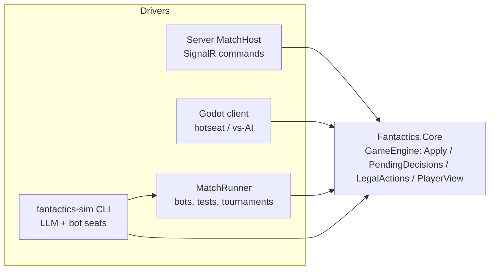

# Fantactics: Simulation, Bots, and LLM Players

> Status: **Draft**, started 2026-09-27. Companion to [TechnicalDesign](TechnicalDesign.md) (architecture, projects) and [GameDesign](GameDesign.md) (rules).

The goals: test rules and computer-controlled players with in-memory simulations that never touch Godot, and let an LLM (e.g. Claude Code) take a player's seat, including playing against itself.

## 1. Goals

- Run full matches (draft → placement → turns → end) **in-process with plain .NET**: no Godot, no server, no network.
- **One rules path.** Simulations, the server, and client hotseat/vs-AI all drive the same Core engine.
- **Deterministic.** The same setup, seed, and command log always produce the same states.
- **No cheating by construction.** Computer players see only their **player view**, never the full state. This matters once hidden moves, fog of war, and invisibility exist.
- **LLM seats.** An LLM can play any seat through a text CLI, against a bot or against another LLM instance.
- The same machinery supports rules unit tests, fuzzing, regression replays, balance tournaments, and exploratory LLM playtests.



## 2. Engine Seams Core Must Expose

These are requirements on `Fantactics.Core`. They're written as API shapes, not final code, and should be built alongside the first rules (Phase 0), not retrofitted.

| Seam | Shape | Why |
|---|---|---|
| `GameState` | Immutable record tree. The RNG state lives *inside* it (`RngState`), so applying a command stays a pure function. | Replay, lookahead, determinism |
| `Decision` | What the game is waiting for: `DraftArmy`, `PlaceStartingArmy`, `SubmitMoveOrders` (simultaneous, every live seat), `ChooseUnitAction(unitId)` (one seat), `MatchOver`. `GameEngine.PendingDecisions(state)` returns them per seat. Clashes resolve automatically and need no decision. | Drivers never hard-code phase logic |
| Commands and events | `ICommand` and `GameEvent` records **defined in Core** and serializable with polymorphic System.Text.Json. Protocol wraps them for transport, and match records store them as-is. `GameEngine.Apply(state, seat, command)` returns `Accepted(newState, events)` or `Rejected(RuleViolation)`. A violation has a stable code and a readable message. Events are fine-grained: one per movement tick or clash strike ([TechnicalDesign §2.2](TechnicalDesign.md#22-command--event-model)). | The same validation for humans, bots, and LLMs; no mapping layer |
| `RulesConfig` | Unit stats and tunable numbers (draft budget and cap, Command income, Held/Braced bonuses, rout threshold, turn limit, ...) loaded from JSON. Traits and abilities are C# code keyed by ID. A config has a stable hash. | Tournaments can A/B test variants without recompiling |
| Unit IDs | Assigned deterministically: draft order first, then summons and arrivals in the order they happen | Stable handles, reproducible replays |
| Simultaneous orders | Each seat's orders go into a `PendingOrders` part of the state as they come in, hidden from the other seats' views. They resolve when every live seat's orders are in. | Hidden movement (GameDesign §4.1), draft, placement (§4.4) |
| `LegalActions` | `LegalActions.For(state, seat)` enumerates the options for each pending decision: attack targets (with preview), abilities, wait, delay, and **per-unit** reachable tiles and deploy tiles for move orders. The joint move space is never enumerated. Joint constraints (e.g. at most 2 arrivals per turn) are checked by `Apply`. | Bots and LLMs pick from real options; the UI uses the same data |
| `Preview` | Exact attack and clash outcome predictions (GameDesign §4.3, UI implications) | The LLM view, bot heuristics, and the client show the same numbers |
| `PlayerView` | `PlayerView.Project(state, seat)`: a filtered, immutable snapshot. Today it's the full state minus every other seat's pending orders, undeployed reserve, and draft (teammates included); later it also applies fog and invisibility. | Bot anti-cheat, the CLI view, server event filtering |
| `StateHash` | A stable hash of a canonical serialization of the state | Replay verification; desync and rules-drift detection |
| `Scenario` | `ScenarioBuilder` plus an **ASCII map format** (terrain chars, a unit overlay, a legend) that can start a match in any phase. The first real map is Riverford ([GameDesign §5.1](GameDesign.md#51-mvp-map-riverford-draft)). | Short tests, readable fixtures, the same format the CLI renders |

**Determinism rules for Core** (enforced by review and by the tests in §7):

- No `System.Random`, `DateTime.Now`, or `Guid.NewGuid`. All randomness comes from `RngState`. In the MVP rules, the only roll is the coin flip for turn-1 tie priority when the starting values on the field are equal (GameDesign §4.1).
- No floating point in rules. Line of sight (GameDesign §5) uses integer math.
- No reliance on dictionary or hash-set iteration order. Use sorted collections or explicit ordering (unit ID, then seat).
- **`StateHash` needs a canonical serialization.** .NET randomizes string hash codes per process, so `ImmutableDictionary` iteration order can differ between runs. State that gets hashed uses `ImmutableSortedDictionary` or arrays, and the hash is SHA-256 over the canonical JSON.

## 3. Projects

New projects, added to [TechnicalDesign §2.1](TechnicalDesign.md#21-solution-layout-decided-2026-09-26):

| Project | Path | Type | Depends on | Purpose |
|---|---|---|---|---|
| `Fantactics.Ai` | `src/Fantactics.Ai` | Class library | Core | `IPlayerAgent`, built-in bots, `MatchRunner`. Also referenced by Client (vs-AI) and Server (bot seats). |
| `Fantactics.Sim` | `src/Fantactics.Sim` | Console app (`fantactics-sim`) | Core, Ai, Protocol; NuGet: `McMaster.Extensions.CommandLineUtils` ([TechnicalDesign §2.3](TechnicalDesign.md#23-command-line-tools-decided-2026-09-27)), `Toon.DotNet`, `Microsoft.Extensions.DependencyInjection` | File-backed match CLI for LLM and human play; text, JSON, and TOON output; tournament runner |
| `Fantactics.Sim.Tests` | `src/tests/Fantactics.Sim.Tests` | xUnit | Sim, Core | Order grammar, unit handles, and in-process CLI tests, including a full match played the way an LLM seat would |
| `Fantactics.Ai.Tests` | `src/tests/Fantactics.Ai.Tests` | xUnit | Core, Ai | Fuzzing, determinism, replay, and bot tests |

The dependency rule still holds: Core references nothing, and nothing references Client, Server, or Sim.

## 4. Computer Players (`Fantactics.Ai`)

- **`IPlayerAgent.Decide(PlayerView view, Decision decision, LegalActions legal) → ICommand`.** It's synchronous and pure CPU, and it never receives a `GameState`. The interface lives in Core (`Fantactics.Core.Players`, moved 2026-09-28) so the local match host can drive bots without referencing Ai. Its view and options use per-player ids; drivers call it through `agent.DecideFor(state, seat)`, which translates the answer back to engine ids.
- **`MatchRunner`** is a pull loop: it asks each seat's agent for its pending decision, calls `Apply`, and repeats until `MatchOver`. It returns a `MatchResult` (winner, end reason Rout / TurnLimit / Draw, turns played, the full `MatchRecord`). An optional per-step observer hooks in invariant checks or logging.
- **Humans don't go through `IPlayerAgent`.** The UI and network submit commands to the push-based `MatchHost` that the server and client host (TechnicalDesign §2.4). `MatchRunner` is just another driver of the same engine.

**Bots, by phase:**

| Agent | Phase | Purpose |
|---|---|---|
| `ScriptedAgent` | 1 | Plays a fixed queue of commands. For tests. |
| `RandomAgent` | 1 | Picks a uniformly random legal option with a seeded RNG. For fuzzing. |
| `TacticalAgent` | 3 | The configurable bot (bot plan Phases 1–2 are done). A **profile** mixes a **difficulty** (search budget and mistakes) with a **style** (evaluation weights such as aggression vs caution). Bots are named `profile[@difficulty]`, e.g. `bot:captain@easy`. Actions are one-ply: it scores every legal action by applying it. For movement it builds one set of orders per **stance** (balanced, all-in, hold line, objective push, fall back, bait), resolves each against an opponent who holds, and keeps the best. Personalities: **Captain** (balanced, objective-minded), **Warden** (defensive), **Berserker** (aggressive), **Trickster** (baits and flanks, unpredictable), and **Bumble** (very stupid). Later phases add action-queue search, sampled opponent orders, Merlin, and weight tuning. |

How `TacticalAgent` works:

- **Belief state.** A bot never gets the real `GameState`. It rebuilds one from its `PlayerView` (`Ai/Belief/BeliefState`, on top of Core's `PlayerView.ToState`), fills the opponent's hidden reserve with a guess that matches the visible reserve value (`ReserveGuesser`), and then drives the real engine for lookahead. No rules are copied into Ai.
- **Evaluator** (`Ai/Evaluation`). Features cover material (scaled by HP), score race, objectives, exposure to next-turn threats (`ThreatMap`, from Core's `ThreatRange`, which the client's threat overlay shares), strike opportunities, terrain, advance, cohesion, disabled enemies, and holding. The same per-unit terms score whole states and candidate move tiles. `Features` holds the raw vector for tuning.
- **Profiles** (`Ai/Profiles/Data/*.json`, embedded). A profile sets `difficulty` (a `difficulty-*.json` preset: novice, easy, normal, hard, expert, master), optional `skill` overrides, and `style` weights. Mistakes come from `MistakeModel`: softmax temperature, blunder chance, and blind spots such as limited vision or ignoring threats. They never produce an illegal move.
- **Style knobs** beyond the evaluator weights: `retreatThreshold` (wounded units pull back), `focusFire` and `bloodlust` (attack preferences), `priorities` (enemy types worth more), `stances` (which stances to consider, with a bonus for each), `stanceTemperature` (unpredictable plans), `formation` (Block, Line, or Flanks placement), `draftBias` and `draftTemperature` (draft preferences), and `reserveEagerness` (below 0.5 the bot drafts a bigger reserve and banks Command for its biggest unit).
- **Determinism.** Budgets count engine simulations, not wall-clock time (`ThinkBudget.MaxMilliseconds` is only for interactive play), so a seed always gives the same match.

## 5. Match Records and Replay

A `MatchRecord` is a JSON file:

```json
{
  "formatVersion": 2,
  "rulesVersion": "0.1.0",
  "rulesConfigHash": "a41e…",
  "seed": 1234,
  "setup": { "scenario": "mvp-riverford", "allowedRaces": { "P1": ["Elves"] },
             "seats": { "P1": "llm", "P2": "bot:random" } },
  "commands": [
    { "seq": 1, "seat": "P1", "command": { "$type": "SubmitMoveOrders", "...": "Core command" }, "stateHashAfter": "9f3c…", "note": "screen the forest" }
  ],
  "start": null,
  "snapshot": { "...": "the whole GameState after the last command" }
}
```

- **Replay** folds `Apply` over the commands, starting from the setup (or from `start`, for a match continued from a saved position). A hash mismatch reports **rules drift** at that `seq`.
- **Format 2 (2026-09-28)** added `start` and `snapshot`, so the record is also the save file (TechnicalDesign §4). Every save writes `snapshot`. Loading (`MatchResume`) keeps the history when it replays and ends at the snapshot. Otherwise it continues from the snapshot and drops the history, with a warning: when the rules changed (the history no longer replays), or when the snapshot was edited by hand (how to set up a test position). Format 1 files still load.
- **Uses:** saves, reconnects, bug reports, and golden regression tests.
- **`note`** is optional free text (a bot's or LLM's reasoning), kept for post-game review. It's never part of the opponent's view.
- **Records stay JSON, not TOON (§6.2).** The LLM never reads the record (§6.1), so a compact format would save no tokens there. JSON also matches how Core commands serialize (System.Text.Json), diffs cleanly for golden replays, and any tool can read it.

## 6. LLM Play via `fantactics-sim`

**Decided 2026-09-27:** LLMs connect only through a file-backed CLI for now. An MCP server and a Claude API `IPlayerAgent` are possible later additions (§8) and aren't designed yet.

### 6.1 The CLI

**The match file *is* the match.** Every call loads the record, replays it, performs one operation, and saves it atomically (a temp file plus a rename, with a lock file for two concurrent players). No process stays running, so Claude Code can drive a match purely through its shell tool.

| Command | Purpose |
|---|---|
| `new --out match.json [--map riverford] [--p1 llm] [--p2 bot:random] [--p3 …] [--p4 …] [--teams 1,2,1,2] [--p1-races Elves,Goblins] [--p2-races any] [--budget 60] [--p1-budget N] [--p2-budget N] [--starting-cap 45] [--p1-starting-cap N] [--p2-starting-cap N] [--seed N] [--force]` | Create a match. Seats are `llm`, `human`, or `bot:<name>`. `--p3` and `--p4` add seats on maps laid out for them (`crossroads` takes four), and `--teams` gives each seat's team in seat order (default: everyone on their own; GameDesign §3). Every seat drafts from every race unless `--p1-races` … `--p4-races` limit it (GameDesign §4.4). `--budget` and `--starting-cap` override the rules' 40 and 30 for every seat, and the `--pN-` forms for one seat; `status` shows each seat's budget/cap (and team, with more than two seats or shared teams). `run` takes the same draft options but stays one against one. Scenario files beyond built-in maps come later. |
| `status match.json [--wait-for P1 [--timeout 600]]` | Phase, turn, which seats owe a decision, and each seat's team (`out` once it's eliminated). Contains no hidden information. `--wait-for` blocks until that seat owes a decision or the match ends (for autonomous self-play agents). |
| `view match.json --as P1` | That seat's `PlayerView`: header, the viewer's totals (`me`) and every opponent's and teammate's (`opponents`, `allies`), map, unit table, reserve, pending decision, events since the seat last acted. In a unit's `side`, units are `you` or `enemy`; with more than two seats, the owner and relation, e.g. `P3 enemy` or `P3 ally`. |
| `legal match.json --as P1 [--unit <id>]` | Numbered action options with attack previews (damage, kills), reachable tiles with costs, deploy tiles, draft or placement options, and a usage line |
| `act match.json --as P1 (--pick N \| --orders "<grammar>" \| --draft "<grammar>" \| --json '<command>') [--note "…"]` | Submit a decision. Prints the visible resulting events (including bot moves that followed), then **the seat's next view and options**, so a playing seat needs one call per decision. The map is included when the next decision is movement or placement. On failure it prints the `RuleViolation` instead. |
| `log match.json --as P1 [--last N]` | That seat's event history |
| `replay match.json [--as P1]` | Full history including every `--note`. Only allowed after the match ends. |
| `run [--p1 bot:random] [--p2 bot:random] [--games 100] [--seed 1] [--map …] [--rules variant.json] [--threads N | --parallel] [--csv out.csv] [--out dir] [--p1-profile file.json] [--p2-profile file.json]` | Tournament (§7): win counts, P1's score rate with a 95% Wilson interval and a significance flag, end reasons, a **style fingerprint** per side (mean first-contact turn, games with no contact, first reserve arrival, objective points, damage dealt and taken, value destroyed), damage/kills/deaths per unit type, and clash wins per pair of unit types (either seat). The summary's size doesn't grow with `--games`. Per-game rows go to `--csv`; `--out` writes `games.csv`, `units.csv`, `clashes.csv`, and `bots.csv`. `--p1-profile`/`--p2-profile` play a profile JSON file (same shape as `src/Fantactics.Ai/Profiles/Data/*.json`) instead of a built-in bot. `--threads 0` (or `--parallel`) plays games on every core, and results are identical for any thread count. `--rules` plays a rules-config variant instead of the built-in rules; `src/Fantactics.Sim/Variants/pre-engagement.json` is the rule set before the 2026-09-27 engagement fixes. The summary shows a short hash of the rules played. |

- **Exit codes:** 0 = ok, 1 = error, 2 = rule violation or bad order syntax, 3 = not your decision (or replay while running).
- **Output format:** every command takes `--format text|toon|json` (§6.2). The default is `text`; the play skill always passes `toon`.
- **Bot seats auto-advance.** After any `act`, the CLI runs bot decisions in-process until a non-bot seat owes a decision or the match ends. An LLM playing a bot then needs one `act` per LLM decision.
- **Shared with the Godot client (decided 2026-09-28).** The CLI and the client host matches on the same Core `MatchHost` and read and write the same files (Protocol's `MatchFiles`, same lock). A seat labeled `human` is a person in the Godot client: it plays through the file and watches it for the LLM's moves (TechnicalDesign §2.5). Bots get a fresh agent per decision seeded from the match seed and the command number (`BotSeeds`), so whichever process plays a bot seat makes the same move. Either side can relabel a seat mid-match (e.g. hand it to a bot), and the other picks the new label up from the file.
- **Hidden information is on the honor system.** The file contains everything, including the opponent's pending hidden orders. LLM seats use only `status`, `view`, `legal`, `act`, and `log`, and never read the file. That's fine for playtesting; real enforcement is the server's job.

**Input forms:**

- `--pick N` for a unit's action: the number of an option from `legal`.
- `--orders` for move and placement orders, in a compact grammar with one clause per unit:
  - `A>5,3`: move unit A to (5,3). Move orders are paths in Core (GameDesign §4.1), so the CLI expands this to the cheapest path, breaking ties deterministically. Waypoints pick a route: `A>3,1>5,3`.
  - `B=hold`: hold.
  - `D@1,7`: deploy reserve unit D on (1,7), or, during placement, place unit D there.
  - Example: `--orders "A>5,3 B=hold D@1,7"`. Units without a clause hold.
- `--draft "Archer Archer Ranger | Scout"`: starting unit types, then `|` and reserve types.
- `--json '<command>'`: the canonical serialized Core command, the same one the network client sends inside its Protocol envelope. `"$type"` must be the first property (a System.Text.Json requirement on .NET 8).

**Unit handles.** Every unit gets a short handle from each seat's point of view: uppercase letters (`A`–`Z`, then `AA`, …) for your units in id order, including reserve and unplaced units, and lowercase for every other player's units (enemies and teammates) in the order they first appeared on the field. Enemy handles are therefore never assigned to hidden units. Handles never change during a match; the engine's own ids stay internal.

### 6.2 Output Formats

**Text** (`--format text`, for humans at a terminal):

```
Turn 3 · Action phase · You: P1 (Elves) · Command 4 · Army value 36 vs 31
Pending: choose action for A (Archer)

    0 1 2 3 4 5 6 7
 0  . . % % . . ^ .
 1  . A % . . g . .
 2  = = = = = = = =
 3  ~ ~ ~ # ~ ~ ~ ~
 4  . B . . + + a .

Terrain: . plains  = road  % forest  + hills  ^ mountains  # bridge  ~ water
Units:   uppercase = yours, lowercase = enemy (terrain under a unit is in the table)

ID  Unit     Pos    Tile    HP    Atk Def Mov Rng  Init  Status
A   Archer   (1,1)  plains  7/7   4   1   4   2-3  5     held
B   Ranger   (1,4)  plains  7/7   3   1   5   1-3  6
g   Grunt    (5,1)  plains  4/5   3   0   4   1    3
a   Tank     (6,4)  hills   7/8   2   2   3   1    2
```

Coordinates are `(x,y)` with the origin at the top left. Terrain uses only non-letter characters, so letters on the map are always units.

**TOON** (`--format toon`, the default for LLM play). [TOON](https://github.com/toon-format/toon) (Token-Oriented Object Notation) encodes the JSON data model with YAML-like indentation and CSV-like tables. It typically saves 30–60% of tokens on uniform arrays, which is most of what a view holds. The same view:

```
turn: 3
phase: action
you: P1
races: Elves 5, Goblins 2
command: 4
armyValue:
  you: 36
  enemy: 31
pending:
  kind: ChooseUnitAction
  unit: A
rows[5]: ..%%..^.,.A%..g..,========,~~~#~~~~,.B..++a.
units[4]{id,side,type,x,y,tile,hp,maxHp,atk,def,mov,rng,init,status}:
  A,you,Archer,1,1,plains,7,7,4,1,4,2-3,5,held
  B,you,Ranger,1,4,plains,7,7,3,1,5,1-3,6,
  g,enemy,Grunt,5,1,plains,4,5,3,0,4,1,3,
  a,enemy,Tank,6,4,hills,7,8,2,2,3,1,2,
```

(Illustrative. Exact quoting follows the TOON spec as `Toon.DotNet` emits it.)

- **One model, three encoders.** The CLI builds output DTOs and serializes them with System.Text.Json to a `JsonNode`. It then prints that node as JSON, hands it to the TOON encoder, or renders text from the same DTOs. There's no separate TOON model to keep in sync.
- **Library:** [`Toon.DotNet`](https://github.com/CharlesHunt/ToonDotNet) 4.1.1 (decided 2026-09-27). It targets net8.0 and TOON spec 4.1.1, and `Toon.FromJson` converts our JSON output directly. It's referenced **only by `Fantactics.Sim`**; Core, Ai, and Protocol stay free of it. The toon-format organization's `Toon.Format` package, the original choice, turned out not to be published on NuGet, and Cysharp's faster `ToonEncoder` needs .NET 10.
- **DTOs are shaped for TOON.** TOON only wins on *uniform* arrays of primitives, so view DTOs are flat:
  - `units[n]{id,side,type,x,y,tile,hp,maxHp,atk,def,mov,rng,init,status}`, with status effects joined into one short string
  - `options[n]{pick,action,target,dmg,kills}` for unit actions
  - `reach[n]{unit,x,y,cost}` for move orders
  - `rows[n]`: the map as row strings, in the same format as scenario files
  - `events[n]{seq,turn,type,actor,target,detail}`: events are heterogeneous, so `log` projects them onto one flat shape instead of encoding them polymorphically
- **Input doesn't need TOON.** `--pick` and the `--orders` grammar are already fewer tokens than any structured payload. TOON input isn't planned; revisit it only if LLMs struggle with the grammar.
- **First measurement (2026-09-27):** a turn-1 movement view is 3,091 characters as JSON, 1,678 as TOON (−46%), and 1,986 as text. Token counts still need the Anthropic token-counting endpoint.
- **Verify before making it the default (Phase 2 exit criterion):**
  - Compare token counts for the same mid-game view in `json`, `toon`, and `text`, using the Anthropic token-counting endpoint.
  - Run a few LLM-vs-`RandomAgent` games per format and compare the rule-violation rate (`act` exit code 2).
  - Choose the default on both cost and accuracy.

### 6.3 LLM Player Playbook

A Claude Code skill, [`.claude/skills/play-fantactics/SKILL.md`](../../.claude/skills/play-fantactics/SKILL.md). It contains:

- **The brief:** pointers to the rules (GameDesign §4–5, RacesAndUnits) and the CLI usage above.
- **The loop:** `view` once to get oriented, then `act` repeatedly (each `act` prints the next decision and its options), with a short `--note` on intent. `status` if unsure whose turn it is.
- **The rules of conduct:** never read the match file. Report suspected rules bugs or confusing rules in `--note` with the prefix `RULES?`.

### 6.4 Self-Play

One Claude Code session acts as **referee**:

1. It creates the match with both seats set to `llm`, and spawns **two background subagents**, each briefed with the playbook and bound to one seat. Separate contexts keep each seat's hidden plans private.
2. Each subagent plays **autonomously**: `status --wait-for <seat>` blocks until its seat owes a decision, then it acts, and repeats until the match ends. (The first design had the referee message a subagent for every decision, but action slots alternate between seats many times per turn, so that would take hundreds of round trips.)
3. When both finish, the referee runs `replay` and summarizes the game, including every `RULES?` note.

The same pattern covers LLM vs. bot (only one subagent is needed, or the session plays the seat itself) and human vs. LLM. The human plays in the Godot client on the same file (`--new --p2 llm --out playtests/x.json`, or `--load` a file with an `llm` seat), or uses `--format text` for their own seat.

## 7. Testing Strategy

| # | Layer | Where | What it catches |
|---|---|---|---|
| 1 | **Rules unit tests** | Core.Tests | One rule per test, set up with `ScenarioBuilder` and ASCII maps |
| 2 | **Enumerator/validator agreement** | Ai.Tests | Every option `LegalActions` lists is accepted by `Apply`, and sampled off-list commands are rejected. Critical, because bots and LLMs trust the enumerator. |
| 3 | **Invariant fuzzing** | Ai.Tests | `RandomAgent` vs. `RandomAgent` over N seeded games, with `Invariants.Check` after every step (below). A failing seed prints its `MatchRecord`. |
| 4 | **Determinism** | Ai.Tests | The same seed produces an identical final `StateHash`, including when games run in parallel threads |
| 5 | **Golden replays** | `src/tests/…/Replays/` | Interesting records (including promoted LLM playtests) must replay with matching hashes. When a rule changes on purpose, re-bless them with a CLI flag. |
| 6 | **Balance tournaments** | `fantactics-sim run` | Win rate per race and seat (with the open draft, RacesAndUnits §2.4: per army shape — mono, two-race, three or more — and per unit), end-reason mix, average turns, damage and kills per unit type, clash win rates per unit-type pair. Manual; a tiny smoke run can go in CI. |
| 7 | **LLM playtests** | `playtests/` (gitignored unless promoted) | Degenerate strategies, confusing rules, unclear views |

Invariants checked in layer 3:

- At most one unit per tile, and only on passable terrain.
- Every living unit has HP > 0; dead units are gone.
- No unit acts twice in a turn; clash winners and units summoned this turn don't act.
- Command is never negative; at most 2 arrivals per turn.
- Army value and destroyed value add up (GameDesign §4.5).
- Every match ends by the turn limit.

## 8. Roadmap

| Phase | Deliverables | Exit criterion |
|---|---|---|
| **0** (with the first Core rules) | The §2 seams, `RulesConfig`, `ScenarioBuilder`, the ASCII map parser, `StateHash`, the determinism rules. Rules cover the **full match flow** (decided 2026-09-27): draft, hidden placement, movement with clashes, actions, reserves and Command, Rout and the turn limit, on Riverford. Scenarios can still start mid-match for focused tests. | Rules tests written against scenarios; a full match can be played start to finish through `Apply` |
| **1** | `Fantactics.Ai`: `IPlayerAgent`, `MatchRunner`, `ScriptedAgent`, `RandomAgent`; `Fantactics.Ai.Tests` for layers 2–4 | Thousands of random games with no invariant failures |
| **2** | `Fantactics.Sim`: match file, `new`/`status`/`view`/`legal`/`act`/`log`/`replay`, text/JSON/TOON output, orders grammar; the play skill | An LLM finishes a game against `RandomAgent`, then a self-play game (**both done 2026-09-27**, §10); the TOON comparison (§6.2) is done (**pending**: needs the token-counting endpoint) |
| **3** | `TacticalAgent` (one-ply), `run` tournaments and stats, golden replays | `TacticalAgent` reliably beats `RandomAgent` (**done 2026-09-28**: `bot:captain` wins 96–100% over 200 games per seat and race; golden replays pending) |
| **Later** | Search in `TacticalAgent` (action queue, sampled opponent orders), Merlin, and weight tuning (personalities done 2026-09-28); fog-of-war determinization; possibly an MCP server or a Claude API `IPlayerAgent` for unattended LLM batches | — |

## 9. Open Questions

1. Should the orders grammar double as the client's debug console input?
2. What tournament scale do we need (games per minute), and will Core need profiling for it?
3. How should LLM playtest findings feed into balance work? A structured `RULES?` report format?
4. ~~The draft uses `--json` for now. Does it deserve its own grammar?~~ It has one: `--draft "Archer Archer Ranger | Scout"`.
5. ~~Enemy unit ids in `PlayerView` are engine ids, which reveal draft sizes.~~ Fixed 2026-09-28: views, legal options, and events use per-player ids (`ViewIds`, TechnicalDesign §2.4); the CLI's handles follow the same order.

## 10. Playtest Log

Findings from LLM playtests. Rules findings graduate to GameDesign once decided; CLI findings become tasks.

### 2026-09-27 · Game 1: LLM (Elves, P1) vs `bot:random` (Goblins), Riverford, seed 7

**Result: P1 wins by Rout on turn 11**, destroyed value 32 to 2. The elves drafted three Archers, a Ranger, a Herbalist, and two Scouts (reserve: Archer, Herbalist, Scout). They held forest pockets overlooking the ford until turn 4, then pushed across and killed the WarLord, the Shaman, the Tank, a Bruiser, three Rushers, and two Grunts, losing one Scout.

Rules findings:

- **`RULES?` Tank Retaliate + Bloodthirst.** Retaliate strikes trigger Bloodthirst 3, so any attack from distance 1 on a Tank heals it (a Scout's 1-damage hit cost the Scout 2 HP and healed the Tank to 6 from 4). Only ranged fire from 2+ tiles works on Tanks. Intended?
- Braced plus Held is strong: holding a forest line in range of the approach gave initiative 8 Archers that shot every charger first.
- Summoned Grunts are worth 0, so the Shaman's summons are free fodder that also block lanes. That's as designed, but it made the Shaman the highest-priority target.
- `bot:random` is too passive to say anything about balance (it wanders and waits a lot). A `GreedyAgent` (Phase 3) is needed before tournaments mean much.

CLI findings:

- Most action decisions only offer wait/delay (or Mend on full-HP allies), and each costs a call. The player wrote a helper that auto-waits those. Candidates: list Mend only for hurt or slowed/rooted allies, and add `act --auto-wait` to skip units with no meaningful option.
- The movement `reach` table is 200–300 rows once the army spreads out; players filter it out and rely on the map. Consider leaving it out of `act` output by default (keeping it in `legal`).
- Nothing blocked play: 232 commands, no grammar errors after the first attempt, no rules crashes.

### 2026-09-27 · Game 2: LLM self-play, Elves (P1) vs Goblins (P2), Riverford, seed 11

Two subagents, each seeing only its own seat and waiting with `status --wait-for`. **Result: P1 wins by Rout at the end of turn 10**, destroyed value 32 to 4, in 206 commands.

- **P1 (Elves)** drafted four Archers, a Ranger, and two Scouts (reserve: Ranger, Herbalist). It held Braced in its home forests with Scouts in front and let the Goblins come.
- **P2 (Goblins)** drafted a Shaman, a Mauler, two Bruisers, three Rushers, and two Grunts (reserve: Bruiser and two Rushers). It staged just out of range for four turns, traded Scouts for a Bruiser on turn 5, then charged on turn 8. Braced Archers (initiative 8) and a held Ranger (7) fired before the moving Rushers (6), and the Goblins lost three Rushers and the Shaman while dealing 1 damage. That score went from 4–4 to 22–4 in one turn.

Rules findings (both players raised the same one):

- **`RULES?` The defender's first volley decides everything.** Holding Braced in edge forest, screened by cheap blockers, means anything that moves into range gets shot by every Archer first. With Support, one shot kills any Goblin except a Bruiser. The attacker always eats the whole volley, so the natural play for both sides is to wait one tile outside range, and a 0–0 draw is easy. This is the "do maps and modes need to force engagement?" question in GameDesign §4.1, now with evidence.
- Support on ranged shots cancels the mountain Defense bonus (4 + 2 − 2). It works as written, but the Goblin player didn't expect it.
- Summoned Grunts worth 0 soaked Braced shots, which is useful and as designed.
- Throw Net rooting an Archer on open ground nearly traded it. Strong, but seems fine.

CLI findings:

- Fixed after this game: violation messages named engine ids ("Unit 12"); they now use handles. `--wait-for` defaulted to a 600s timeout, the same as the agent watchdog, and now defaults to 240s.
- Both players scripted auto-waits (about 80% of action prompts had no real choice). One script fired Call the Horde by accident because untargeted ability rows look like wait rows. This supports `act --auto-wait` and dropping Mend on full-HP allies from the list.
- Wanted: a "who can hit this tile" threat view, and a Held/Braced preview while giving move orders.
- The `reach` table leaves out tiles a friend holds now but will vacate. That's conservative by design, but it hides legal moves.

### 2026-09-28 · Bot tournaments: personalities (bot plan Phase 2)

One-ply `TacticalAgent` profiles on Riverford, 100–200 games per pairing. These are bots, not people, so they measure what the evaluator can find, but two results are worth a design look:

- **Caution loses under the objective rule.** Starting from Captain and adding one defensive trait at a time (more terrain weight, more fear of exposure, less advance, holding, a banked reserve), every trait lowered the win rate, and they compound. A terrain weight of 0.8 alone dropped Captain vs Captain from 79 to 35 wins as Elves: units sat in forest instead of standing on the plains ford tiles. Warden (defensive) wins only about 20% as Elves against Captain, and Berserker beat Warden 200–0 on objective points while destroying *less* value. The 2026-09-27 engagement fixes worked, perhaps too well: holding ground is now close to strictly worse than contesting the ford.
- **Elves are favored in the mirror.** Captain vs Captain: Elves as P1 win 79 of 100 and Goblins as P1 win 24 of 100. Berserker is the only personality that does well with Goblins (41 of 100 against a Captain playing Elves). This is the same Archer-heavy imbalance the LLM games showed.

Fingerprints against Captain (as Elves, P1): Berserker makes first contact on turn 2.3, Captain 2.6, Trickster 2.9, Bumble 2.9–3.7, and the original Warden 7.8 (never engaging in 28% of games). Profile changes: Warden's terrain weight went from 0.8 to 0.4 and its exposure weight from 1.2 to 0.45, so it contests objectives at all.

### 2026-09-28 · Race balance: Goblin options, Wolf Rider adopted

Measured as the Elves' score rate in Captain-vs-Captain games, averaged over both seats (600 games per row; 0.50 is even).

| Change | Elves |
|---|---|
| Rules 0.3.0 | 0.78 |
| Archer cost 6 (nerf, not adopted) | 0.57 |
| Bruiser HP 9 | 0.48 |
| Grunt Attack 4 | 0.55 |
| Rusher HP 6 / Rusher cost 2 | 0.68 / 0.70 |
| Slinger (ranged Goblin, Cost 3, range 2–3) | 0.68 |
| Shieldbearer (Cost 3, HP 6, Def 2) | 0.73 |
| **Wolf Rider (Cost 4, HP 7, Atk 4, Mv 7, Init 6, Bloodthirst 1, Reckless)** | **0.48** |

Closing the gap before the Archers' second volley mattered more than shooting back or armoring up. The Wolf Rider went into rules 0.4.0. With it, Captain as Elves scores 0.48 as P1 and 0.48 as P2, the bots field about 2.4 per Goblin game, and every normal personality still beats `bot:random` as Goblins (192–199 of 200). Objective-rule variants tested in the same session (entrenched objectives, per-tile scoring, hills at the ford) did not help cautious play and are not adopted.

### 2026-09-28 · Open draft: first tournaments (rules 0.6.0)

Captain vs Captain on Riverford, 300 games per row. Score is P1's rate (0.50 is even).

| P1 may draft | P2 may draft | P1 score |
|---|---|---|
| Elves | Goblins | 0.477 |
| Goblins | Elves | 0.493 |
| any | any | 0.495 |
| Elves | any | 0.345 |
| Goblins | any | 0.467 |

- Race-locked play is unchanged: Elves average about 0.49 over both seats, as before (the own-race scope can't trigger in a mono army).
- **`RULES?` The open-draft Captain always drafts the same army: four Archers, three Rangers, and one filler Grunt.** Its power-per-cost rating favours Elf shooters, and `raceFocus` 1.0 doesn't stop the last 2 points going to a Grunt. That army beats a mono-Elf draft (0.655 for the open side) and edges mono-Goblins. Every army came out two-race, so the "each race's best units" failure mode (RacesAndUnits §2.4) shows up at once. Next steps: an Elf same-race aura (RacesAndUnits §7, question 10), a draft rating that values auras, and more draft variety in the personalities.

### 2026-09-30 · Baseline before the VP/missions rework (rules 0.6.0, ALE-42)

This baseline records the current attrition game (turn-limit score = destroyed value + ford points) before VP missions, attack types, and N seats (ALE-43, ALE-45) change anything. The N-seat refactor must reproduce these numbers exactly with the same seeds. All runs are Captain vs Captain on Riverford, 500 games, seeds 1–500, rules hash `3aceea381599` (rules 0.6.0). **Reproduced by ALE-43 on rules 0.7.0** (2–4 seats and teams): all three runs' `games.csv`, `units.csv`, `clashes.csv`, and `bots.csv` came out byte-identical.

```
fantactics-sim run --p1 bot:captain --p2 bot:captain --games 500 --seed 1 --threads 0 --out <dir>
# race-locked rows add --p1-races Elves --p2-races Goblins (or the reverse)
```

| Draft | P1–P2–draws | P1 score (95% CI) | Avg turns | End reasons (Rout P1/P2/draw · TurnLimit P1/P2/draw) | Mean turn-limit score P1 / P2 (all · TurnLimit games) |
|---|---|---|---|---|---|
| **open (any vs any)** | 252–247–1 | 0.505 (0.461–0.549) | 13.2 | 109/93/1 · 143/154/0 | 34.9 / 33.6 · 34.4 / 33.7 |
| Elves vs Goblins | 235–263–2 | 0.472 (0.429–0.516) | 13.5 | 116/79/0 · 119/184/2 | 31.8 / 37.1 · 30.4 / 37.4 |
| Goblins vs Elves | 246–253–1 | 0.493 (0.449–0.537) | 13.4 | 76/123/0 · 170/130/1 | 35.9 / 32.0 · 36.0 / 30.9 |

- **Race balance.** In the open draft, all 1,000 armies were Elves+Goblins, scoring 0.500. As before, the Captain drafts four Archers, three Rangers, and a Grunt every game. Race-locked, Elves score 0.490 over both seats. About 60% of games reach the turn limit.
- **Mean turn-limit score** is destroyed value plus objective points per seat, taken from `games.csv`. It is given over all games and over games that ended at the turn limit.

**Clash table.** The open-draft mirror only has Archer, Ranger, and Grunt clashes, so the cross-race rows below come from the two race-locked runs combined. Rate is the Elf unit's share of the clashes it fought (no clash hit the strike cap).

| Elf | vs Goblin | Clashes | Elf wins | Elf rate |
|---|---|---|---|---|
| Archer | Grunt | 314 | 265 | 0.844 |
| Archer | Tank | 46 | 15 | 0.326 |
| Archer | Bruiser | 223 | 56 | 0.251 |
| Archer | Mauler | 122 | 30 | 0.246 |
| Archer | WarLord | 137 | 14 | 0.102 |
| Archer | WolfRider | 73 | 4 | 0.055 |
| Ranger | Grunt | 179 | 41 | 0.229 |
| Ranger | Mauler | 80 | 14 | 0.175 |
| Ranger | Tank | 75 | 9 | 0.120 |
| Ranger | WarLord | 87 | 7 | 0.080 |
| Ranger | Bruiser | 220 | 11 | 0.050 |
| Ranger | WolfRider | 209 | 2 | 0.010 |

In the open mirror, Archers beat Grunts (0.810) but lose to Rangers (0.342), and Grunts beat Rangers (0.782). Mirror rows (Archer vs Archer, etc.) have no meaningful rate, because "A" is just the first unit the clash event names.

- **Archers don't win clashes against tanky melee units.** They win only a third against the Tank and a quarter against the Bruiser and Mauler, which matches the hand math: a 1-damage slog on plains and a coin flip on forest. Clashing at half Attack makes Rangers worse still: they lose to everything but other Elves. This is the starting point for the attack-types and melee-trait tuning (ALE-45, ALE-46).
