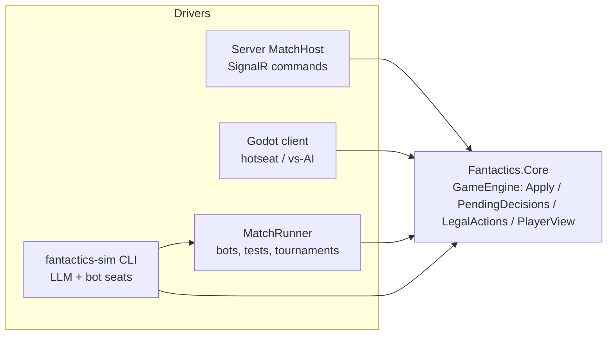

# Fantactics: Simulation, Bots, and LLM Players

> Status: **Draft**, started 2026-09-27. Companion to [TechnicalDesign](TechnicalDesign.md) (architecture, projects) and [GameDesign](GameDesign.md) (rules).

The goals: test rules and computer-controlled players with in-memory simulations that never touch Godot, and let an LLM (e.g. Claude Code) take a player's seat, including playing against itself.

## 1. Goals

- Run full matches (draft → placement → turns → end) **in-process with plain .NET**: no Godot, no server, no network.
- **One rules path.** Simulations, the server, and client hotseat/vs-AI all drive the same Core engine.
- **Deterministic.** The same setup, seed, and command log always produce the same states.
- **No cheating by construction.** Computer players see only their **player view**, never the full state. This matters once hidden moves, fog of war, and invisibility exist.
- **LLM seats.** An LLM can play any seat through a text CLI, against a bot or against another LLM instance.
- The same machinery supports rules unit tests, fuzzing, regression replays, balance tournaments, and exploratory LLM playtests.



## 2. Engine Seams Core Must Expose

These are requirements on `Fantactics.Core`. They're written as API shapes, not final code, and should be built alongside the first rules (Phase 0), not retrofitted.

| Seam | Shape | Why |
|---|---|---|
| `GameState` | Immutable record tree. The RNG state lives *inside* it (`RngState`), so applying a command stays a pure function. | Replay, lookahead, determinism |
| `Decision` | What the game is waiting for: `DraftArmy`, `PlaceStartingArmy`, `SubmitMoveOrders` (simultaneous, both seats), `ChooseUnitAction(unitId)` (one seat), `MatchOver`. `GameEngine.PendingDecisions(state)` returns them per seat. Clashes resolve automatically and need no decision. | Drivers never hard-code phase logic |
| Commands and events | `ICommand` and `GameEvent` records **defined in Core** and serializable with polymorphic System.Text.Json. Protocol wraps them for transport, and match records store them as-is. `GameEngine.Apply(state, seat, command)` returns `Accepted(newState, events)` or `Rejected(RuleViolation)`. A violation has a stable code and a readable message. Events are fine-grained: one per movement tick or clash strike ([TechnicalDesign §2.2](TechnicalDesign.md#22-command--event-model)). | The same validation for humans, bots, and LLMs; no mapping layer |
| `RulesConfig` | Unit stats and tunable numbers (draft budget and cap, Command income, Held/Braced bonuses, rout threshold, turn limit, ...) loaded from JSON. Traits and abilities are C# code keyed by ID. A config has a stable hash. | Tournaments can A/B test variants without recompiling |
| Unit IDs | Assigned deterministically: draft order first, then summons and arrivals in the order they happen | Stable handles, reproducible replays |
| Simultaneous orders | The first seat's orders go into a `PendingOrders` part of the state, hidden from the other seat's view. They resolve when both seats are in. | Hidden movement (GameDesign §4.1), draft, placement (§4.4) |
| `LegalActions` | `LegalActions.For(state, seat)` enumerates the options for each pending decision: attack targets (with preview), abilities, wait, delay, and **per-unit** reachable tiles and deploy tiles for move orders. The joint move space is never enumerated. Joint constraints (e.g. at most 2 arrivals per turn) are checked by `Apply`. | Bots and LLMs pick from real options; the UI uses the same data |
| `Preview` | Exact attack and clash outcome predictions (GameDesign §4.3, UI implications) | The LLM view, bot heuristics, and the client show the same numbers |
| `PlayerView` | `PlayerView.Project(state, seat)`: a filtered, immutable snapshot. Today it's the full state minus the opponent's pending orders, undeployed reserve, and draft; later it also applies fog and invisibility. | Bot anti-cheat, the CLI view, server event filtering |
| `StateHash` | A stable hash of a canonical serialization of the state | Replay verification; desync and rules-drift detection |
| `Scenario` | `ScenarioBuilder` plus an **ASCII map format** (terrain chars, a unit overlay, a legend) that can start a match in any phase. The first real map is Riverford ([GameDesign §5.1](GameDesign.md#51-mvp-map-riverford-draft)). | Short tests, readable fixtures, the same format the CLI renders |

**Determinism rules for Core** (enforced by review and by the tests in §7):

- No `System.Random`, `DateTime.Now`, or `Guid.NewGuid`. All randomness comes from `RngState`. In the MVP rules, the only roll is the coin flip for turn-1 tie priority when the starting values on the field are equal (GameDesign §4.1).
- No floating point in rules. Line of sight (GameDesign §5) uses integer math.
- No reliance on dictionary or hash-set iteration order. Use sorted collections or explicit ordering (unit ID, then seat).
- **`StateHash` needs a canonical serialization.** .NET randomizes string hash codes per process, so `ImmutableDictionary` iteration order can differ between runs. State that gets hashed uses `ImmutableSortedDictionary` or arrays, and the hash is SHA-256 over the canonical JSON.

## 3. Projects

New projects, added to [TechnicalDesign §2.1](TechnicalDesign.md#21-solution-layout-decided-2026-09-26):

| Project | Path | Type | Depends on | Purpose |
|---|---|---|---|---|
| `Fantactics.Ai` | `src/Fantactics.Ai` | Class library | Core | `IPlayerAgent`, built-in bots, `MatchRunner`. Also referenced by Client (vs-AI) and Server (bot seats). |
| `Fantactics.Sim` | `src/Fantactics.Sim` | Console app (`fantactics-sim`) | Core, Ai, Protocol, `Toon.Format` (NuGet) | File-backed match CLI for LLM and human play; text, JSON, and TOON output; tournament runner |
| `Fantactics.Ai.Tests` | `src/tests/Fantactics.Ai.Tests` | xUnit | Core, Ai | Fuzzing, determinism, replay, and bot tests |

The dependency rule still holds: Core references nothing, and nothing references Client, Server, or Sim.

## 4. Computer Players (`Fantactics.Ai`)

- **`IPlayerAgent.Decide(PlayerView view, Decision decision, LegalActions legal) → ICommand`.** It's synchronous and pure CPU, and it never receives a `GameState`.
- **`MatchRunner`** is a pull loop: it asks each seat's agent for its pending decision, calls `Apply`, and repeats until `MatchOver`. It returns a `MatchResult` (winner, end reason Rout / TurnLimit / Draw, turns played, the full `MatchRecord`). An optional per-step observer hooks in invariant checks or logging.
- **Humans don't go through `IPlayerAgent`.** The UI and network submit commands to the push-based `Match` wrapper that the server and client host. `MatchRunner` is just another driver of the same engine.

**Bots, by phase:**

| Agent | Phase | Purpose |
|---|---|---|
| `ScriptedAgent` | 1 | Plays a fixed queue of commands. For tests. |
| `RandomAgent` | 1 | Picks a uniformly random legal option with a seeded RNG. For fuzzing. |
| `GreedyAgent` | 3 | One-ply heuristics: best preview damage and kills, move toward targets and defensive terrain, deploy when affordable. Scores through a shared `Evaluator`. |
| `SearchAgent` | Later | MCTS or expectimax over the action phase. Samples opponent move orders for the simultaneous phase, and later determinizes hidden information. |

## 5. Match Records and Replay

A `MatchRecord` is a JSON file:

```json
{
  "formatVersion": 1,
  "rulesVersion": "0.1.0",
  "rulesConfigHash": "a41e…",
  "seed": 1234,
  "setup": { "scenario": "mvp-riverford", "races": { "P1": "Elves", "P2": "Goblins" },
             "seats": { "P1": "llm", "P2": "bot:random" } },
  "commands": [
    { "seq": 1, "seat": "P1", "command": { "$type": "SubmitMoveOrders", "...": "Core command" }, "stateHashAfter": "9f3c…", "note": "screen the forest" }
  ]
}
```

- **Replay** folds `Apply` over the commands, starting from the setup. A hash mismatch reports **rules drift** at that `seq`.
- **Uses:** saves, reconnects, bug reports, and golden regression tests.
- **`note`** is optional free text (a bot's or LLM's reasoning), kept for post-game review. It's never part of the opponent's view.
- **Records stay JSON, not TOON (§6.2).** The LLM never reads the record (§6.1), so a compact format would save no tokens there. JSON also matches how Core commands serialize (System.Text.Json), diffs cleanly for golden replays, and any tool can read it.

## 6. LLM Play via `fantactics-sim`

**Decided 2026-09-27:** LLMs connect only through a file-backed CLI for now. An MCP server and a Claude API `IPlayerAgent` are possible later additions (§8) and aren't designed yet.

### 6.1 The CLI

**The match file *is* the match.** Every call loads the record, replays it, performs one operation, and saves it atomically (a temp file plus a rename, with a lock file for two concurrent players). No process stays running, so Claude Code can drive a match purely through its shell tool.

| Command | Purpose |
|---|---|
| `new --scenario <name\|file> --p1 llm\|bot:<name> --p2 … --seed N --out match.json` | Create a match |
| `status match.json` | Phase, turn, and which seats owe a decision. Contains no hidden information. |
| `view match.json --as P1` | That seat's `PlayerView`: header, map, unit table, pending decision, events since the seat last acted |
| `legal match.json --as P1 [--unit <id>]` | Enumerated options with pick IDs, attack previews (damage, kills), reachable tiles with costs |
| `act match.json --as P1 (--pick <id> \| --orders "<grammar>" \| --json '<command>') [--note "…"]` | Submit a decision. Prints the visible resulting events (including bot moves that followed), then **the seat's next pending decision with its legal options**, so a playing seat needs one call per decision. On failure it prints the `RuleViolation` instead. |
| `log match.json --as P1` | That seat's filtered event history |
| `replay match.json` | Full-information replay. Only allowed after `MatchOver`. |
| `run --p1 bot:greedy --p2 bot:random --games 500 --seed 1 [--parallel] [--csv out.csv]` | Tournament (§7) |

- **Exit codes:** 0 = ok, 1 = error, 2 = rule violation, 3 = not your decision.
- **Output format:** `view`, `legal`, `log`, `replay`, and `act` take `--format toon|json|text` (§6.2).
- **Bot seats auto-advance.** After any `act`, the CLI runs bot decisions in-process until a non-bot seat owes a decision or the match ends. An LLM playing a bot then needs one `act` per LLM decision.
- **Hidden information is on the honor system.** The file contains everything, including the opponent's pending hidden orders. LLM seats use only `status`, `view`, `legal`, `act`, and `log`, and never read the file. That's fine for playtesting; real enforcement is the server's job.

**Input forms:**

- `--pick <id>` for single-choice decisions, such as a unit's action.
- `--orders` for move orders, in a compact grammar with one clause per unit:
  - `A>5,3`: move unit A to (5,3). Move orders are paths in Core (GameDesign §4.1), so the CLI expands this to the cheapest path, breaking ties deterministically. Waypoints pick a route: `A>3,1>5,3`.
  - `B=hold`: hold.
  - `r1@1,7`: deploy reserve r1 on (1,7).
  - Example: `--orders "A>5,3 B=hold r1@1,7"`. Units without a clause default to Hold.
- `--json '<command>'`: the canonical serialized Core command, the same one the network client sends inside its Protocol envelope. The draft uses this form until it earns a grammar of its own.

**Unit handles.** The CLI gives each unit a short handle when it enters the map: uppercase letters `A`–`Z` for your units and lowercase for the enemy's, from your seat's point of view. Reserves are `r1`, `r2`, …. Handles are stable for the whole match. The engine's own IDs stay internal.

### 6.2 Output Formats

**Text** (`--format text`, for humans at a terminal):

```
Turn 3 · Action phase · You: P1 (Elves) · Command 4 · Army value 36 vs 31
Pending: choose action for A (Archer)

    0 1 2 3 4 5 6 7
 0  . . % % . . ^ .
 1  . A % . . g . .
 2  = = = = = = = =
 3  ~ ~ ~ # ~ ~ ~ ~
 4  . B . . + + a .

Terrain: . plains  = road  % forest  + hills  ^ mountains  # bridge  ~ water
Units:   uppercase = yours, lowercase = enemy (terrain under a unit is in the table)

ID  Unit     Pos    Tile    HP    Atk Def Mov Rng  Init  Status
A   Archer   (1,1)  plains  7/7   4   1   4   2-3  5     held
B   Ranger   (1,4)  plains  7/7   3   1   5   1-3  6
g   Grunt    (5,1)  plains  4/5   3   0   4   1    3
a   Tank     (6,4)  hills   7/8   2   2   3   1    2
```

Coordinates are `(x,y)` with the origin at the top left. Terrain uses only non-letter characters, so letters on the map are always units.

**TOON** (`--format toon`, the default for LLM play). [TOON](https://github.com/toon-format/toon) (Token-Oriented Object Notation) encodes the JSON data model with YAML-like indentation and CSV-like tables. It typically saves 30–60% of tokens on uniform arrays, which is most of what a view holds. The same view:

```
turn: 3
phase: action
you: P1
race: Elves
command: 4
armyValue:
  you: 36
  enemy: 31
pending:
  kind: ChooseUnitAction
  unit: A
rows[5]: ..%%..^.,.A%..g..,========,~~~#~~~~,.B..++a.
units[4]{id,side,type,x,y,tile,hp,maxHp,atk,def,mov,rng,init,status}:
  A,you,Archer,1,1,plains,7,7,4,1,4,2-3,5,held
  B,you,Ranger,1,4,plains,7,7,3,1,5,1-3,6,
  g,enemy,Grunt,5,1,plains,4,5,3,0,4,1,3,
  a,enemy,Tank,6,4,hills,7,8,2,2,3,1,2,
```

(Illustrative. Exact quoting follows the TOON v3 spec as `Toon.Format` emits it.)

- **One model, three encoders.** The CLI builds output DTOs and serializes them with System.Text.Json to a `JsonNode`. It then prints that node as JSON, hands it to the TOON encoder, or renders text from the same DTOs. There's no separate TOON model to keep in sync.
- **Library:** [`Toon.Format`](https://github.com/toon-format/toon-dotnet) (the toon-format organization's .NET port). It targets net8.0, conforms to TOON spec v3.0, and encodes and decodes through `JsonNode`. It's referenced **only by `Fantactics.Sim`**; Core, Ai, and Protocol stay free of it. Cysharp's faster `ToonEncoder` needs .NET 10, so it's out while we're on .NET 8.
- **DTOs are shaped for TOON.** TOON only wins on *uniform* arrays of primitives, so view DTOs are flat:
  - `units[n]{id,side,type,x,y,tile,hp,maxHp,atk,def,mov,rng,init,status}`, with status effects joined into one short string
  - `options[n]{pick,action,target,dmg,kills}` for unit actions
  - `reach[n]{unit,x,y,cost}` for move orders
  - `rows[n]`: the map as row strings, in the same format as scenario files
  - `events[n]{seq,turn,type,actor,target,detail}`: events are heterogeneous, so `log` projects them onto one flat shape instead of encoding them polymorphically
- **Input doesn't need TOON.** `--pick` and the `--orders` grammar are already fewer tokens than any structured payload. TOON input isn't planned; revisit it only if LLMs struggle with the grammar.
- **Verify before making it the default (Phase 2 exit criterion):**
  - Compare token counts for the same mid-game view in `json`, `toon`, and `text`, using the Anthropic token-counting endpoint.
  - Run a few LLM-vs-`RandomAgent` games per format and compare the rule-violation rate (`act` exit code 2).
  - Choose the default on both cost and accuracy.

### 6.3 LLM Player Playbook

A Claude Code skill, `.claude/skills/play-fantactics/SKILL.md`, checked in when Phase 2 lands. It contains:

- **The brief:** pointers to the rules (GameDesign §4–5, RacesAndUnits) and the CLI usage above.
- **The loop:** `view` once to get oriented, then `act` repeatedly (each `act` prints the next decision and its options), with a short `--note` on intent. `status` if unsure whose turn it is.
- **The rules of conduct:** never read the match file. Report suspected rules bugs or confusing rules in `--note` with the prefix `RULES?`.

### 6.4 Self-Play

One Claude Code session acts as **referee**:

1. It creates the match with both seats set to `llm`, and spawns **two subagents**, each briefed with the playbook and bound to one seat. Separate contexts keep each seat's hidden plans private.
2. It loops on `status`. When a seat owes a decision, it messages that seat's subagent, which keeps its own context between turns. In simultaneous phases it messages both.
3. At `MatchOver` it runs `replay` and summarizes the game, including every `RULES?` note.

The same pattern covers LLM vs. bot (only one subagent is needed, or the session plays the seat itself) and human vs. LLM (the human uses `--format text` for their own seat).

## 7. Testing Strategy

| # | Layer | Where | What it catches |
|---|---|---|---|
| 1 | **Rules unit tests** | Core.Tests | One rule per test, set up with `ScenarioBuilder` and ASCII maps |
| 2 | **Enumerator/validator agreement** | Ai.Tests | Every option `LegalActions` lists is accepted by `Apply`, and sampled off-list commands are rejected. Critical, because bots and LLMs trust the enumerator. |
| 3 | **Invariant fuzzing** | Ai.Tests | `RandomAgent` vs. `RandomAgent` over N seeded games, with `Invariants.Check` after every step (below). A failing seed prints its `MatchRecord`. |
| 4 | **Determinism** | Ai.Tests | The same seed produces an identical final `StateHash`, including when games run in parallel threads |
| 5 | **Golden replays** | `src/tests/…/Replays/` | Interesting records (including promoted LLM playtests) must replay with matching hashes. When a rule changes on purpose, re-bless them with a CLI flag. |
| 6 | **Balance tournaments** | `fantactics-sim run` | Win rate per race and seat, end-reason mix, average turns, damage and kills per unit type. Manual; a tiny smoke run can go in CI. |
| 7 | **LLM playtests** | `playtests/` (gitignored unless promoted) | Degenerate strategies, confusing rules, unclear views |

Invariants checked in layer 3:

- At most one unit per tile, and only on passable terrain.
- Every living unit has HP > 0; dead units are gone.
- No unit acts twice in a turn; clash winners and units summoned this turn don't act.
- Command is never negative; at most 2 arrivals per turn.
- Army value and destroyed value add up (GameDesign §4.5).
- Every match ends by the turn limit.

## 8. Roadmap

| Phase | Deliverables | Exit criterion |
|---|---|---|
| **0** (with the first Core rules) | The §2 seams, `RulesConfig`, `ScenarioBuilder`, the ASCII map parser, `StateHash`, the determinism rules. Rules cover the **full match flow** (decided 2026-09-27): draft, hidden placement, movement with clashes, actions, reserves and Command, Rout and the turn limit, on Riverford. Scenarios can still start mid-match for focused tests. | Rules tests written against scenarios; a full match can be played start to finish through `Apply` |
| **1** | `Fantactics.Ai`: `IPlayerAgent`, `MatchRunner`, `ScriptedAgent`, `RandomAgent`; `Fantactics.Ai.Tests` for layers 2–4 | Thousands of random games with no invariant failures |
| **2** | `Fantactics.Sim`: match file, `new`/`status`/`view`/`legal`/`act`/`log`/`replay`, text/JSON/TOON output, orders grammar; the play skill | An LLM finishes a game against `RandomAgent`, then a self-play game; the TOON comparison (§6.2) is done |
| **3** | `GreedyAgent`, `run` tournaments and stats, golden replays | `GreedyAgent` reliably beats `RandomAgent` |
| **Later** | `SearchAgent`, fog-of-war determinization; possibly an MCP server or a Claude API `IPlayerAgent` for unattended LLM batches | — |

## 9. Open Questions

1. Should the orders grammar double as the client's debug console input?
2. What tournament scale do we need (games per minute), and will Core need profiling for it?
3. How should LLM playtest findings feed into balance work? A structured `RULES?` report format?
4. The draft uses `--json` for now. Does it deserve its own grammar (e.g. `"Archer*2 Ranger"`)?
