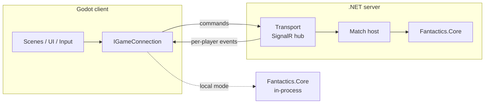

# Fantactics: Technical Design

> Status: **Draft**, started 2026-09-26. Companion to [GameDesign](GameDesign.md).

## 1. Goals

- Local (hotseat), LAN, and online play all run the **same rules code**.
- The server is **authoritative**. Clients can't cheat or see hidden information (fog of war, traps, invisible units).
- Networking lives **outside Godot**. The Godot project is a presentation layer.
- Game rules are testable with plain `dotnet test`, without Godot.

## 2. Architecture

The key decision: **keep game rules in a plain C# library with no dependency on Godot**, shared by the Godot client and the .NET server. The network layer then only moves commands and events. It never contains game logic.



Headless simulation, computer players, and LLM players drive the same Core engine in memory, with no Godot and no server. See [Simulation](Simulation.md).

### 2.1 Solution Layout (decided 2026-09-26)

All code lives under `src/` (solution at `src/Fantactics.sln`); the repo root holds only docs and config. All projects target `net8.0`.

| Project | Path | Type | Depends on | Purpose |
|---|---|---|---|---|
| `Fantactics.Core` | `src/Fantactics.Core` | Class library | — | Game state, rules, map, units, serializable commands and events, rules config loading, seeded RNG. **No Godot or network references.** |
| `Fantactics.Protocol` | `src/Fantactics.Protocol` | Class library | Core | Transport envelopes around Core's commands and events, shared by client and server; `IGameConnection` and `LocalMatch` (§2.4); match files (`MatchFiles`, `SharedMatchFile`) shared with the Sim CLI (§2.5) |
| `Fantactics.Server` | `src/Fantactics.Server` | ASP.NET Core app | Core, Protocol | Hosts matches (SignalR hub at `/game`), lobbies, LAN discovery responder |
| `Fantactics.Client` | `src/Fantactics.Client` | Godot .NET project (`project.godot` lives here) | Core, Protocol, Ai, Client.Logic | Scenes, rendering, input, audio; talks to a match only through `IGameConnection` (§2.4, §2.5) |
| `Fantactics.Client.Logic` | `src/Fantactics.Client.Logic` | Class library | Core, Protocol | Presentation logic without Godot: input builders, playback timeline, board model, session, launch options (§2.5) |
| `Fantactics.Ai` | `src/Fantactics.Ai` | Class library | Core | Computer players (bots implementing Core's `IPlayerAgent`) and `MatchRunner`; used by Client, Server, and Sim. See [Simulation §3](Simulation.md#3-projects) |
| `Fantactics.Sim` | `src/Fantactics.Sim` | Console app | Core, Ai, Protocol | `fantactics-sim`: file-backed match CLI for LLM play, tournaments; built on CommandLineUtils (§2.3). See [Simulation §6](Simulation.md#6-llm-play-via-fantactics-sim) |
| `Fantactics.Core.Tests` | `src/tests/Fantactics.Core.Tests` | xUnit | Core | Rules tests |
| `Fantactics.Ai.Tests` | `src/tests/Fantactics.Ai.Tests` | xUnit | Core, Ai | Fuzzing, determinism, replay, and bot tests |
| `Fantactics.Client.Logic.Tests` | `src/tests/Fantactics.Client.Logic.Tests` | xUnit | Client.Logic, Ai | Input builders fuzzed against bot-match states, playback coverage, sessions |
| `Fantactics.Sim.Tests` | `src/tests/Fantactics.Sim.Tests` | xUnit | Sim, Core | CLI grammar and in-process CLI tests |

Dependency rule: nothing references `Fantactics.Client`, `Fantactics.Server`, or `Fantactics.Sim`, and `Fantactics.Core` references nothing.

### 2.2 Command / Event Model

- Clients send **commands** (intent), each answering one pending decision:
  - Before the match: `SubmitDraft`, then `PlaceStartingArmy` (both simultaneous and hidden).
  - Each turn: `SubmitMoveOrders` (paths, holds, and reserve deploys; one per player, held hidden until both are in), then `Attack`, `UseAbility`, `Wait`, or `Delay` for the unit whose initiative slot is up (see GameDesign §4.1–4.4).
- The server validates each command against the current state and, if it's legal, applies it and produces **events** (facts).
- **Events are fine-grained** (decided 2026-09-27): one per tick or strike, e.g. `UnitStepped(tick, from, to)`, `ClashMarked`, `ClashStrike`, `UnitDamaged`, `UnitHealed`, `StatusApplied`, `UnitDied`, `UnitArrived`, `TileChanged`, `TurnEnded`. The client can animate from them, and replays and logs never need a rewrite for more detail.
- **Commands and events are defined in Core** as records, serializable with polymorphic System.Text.Json (part of the standard library, so Core still doesn't reference networking). Protocol only wraps them for transport, and match records store them directly. There's no mapping layer. (Decided 2026-09-27.)
- Movement resolution is a pure Core function of the state and every player's move orders.
- Events are **filtered per player** before sending (a unit moving in the fog of war is not revealed).
- Randomness is rolled **on the server only**, with a seeded RNG.
- Game state is **immutable** (records + immutable collections); applying a command returns a new state. This makes replays, undo, and AI lookahead cheap to reason about. (Decided 2026-09-26.)
- Benefits: replays = initial state + seed + command log; reconnect = resend the player's filtered view of the state; hotseat and AI use the same path.
- The RNG state lives inside `GameState`, so applying a command is a pure function. Core also exposes `PendingDecisions`, `LegalActions`, `Preview`, `PlayerView.Project`, and `StateHash`, the seams every driver (server, client, bots, simulation) relies on. See [Simulation §2](Simulation.md#2-engine-seams-core-must-expose).

### 2.3 Command-Line Tools (decided 2026-09-27)

All command-line tools (first `fantactics-sim`, [Simulation §6](Simulation.md#6-llm-play-via-fantactics-sim)) parse arguments with **[McMaster.Extensions.CommandLineUtils](https://github.com/natemcmaster/CommandLineUtils)** (NuGet `McMaster.Extensions.CommandLineUtils`).

- **Attribute API.** Each subcommand is its own class with `[Command]` and `[Option]`/`[Argument]` attributes, registered on the root command with `[Subcommand]`. That keeps one type per file, and the help text is generated from the attributes.
- **Exit codes come from `OnExecute`,** which returns an `int`, so each tool's exit-code contract (e.g. Simulation §6.1: 0 ok, 1 error, 2 rule violation, 3 not your decision) lives in the command classes. Parse and validation errors exit with 1.
- **Services through constructor injection.** Use the library's `IServiceProvider` support (`app.Conventions.UseConstructorInjection(services)`), with primary constructors per the C# conventions.
- **Only command-line projects reference it.** Core, Ai, and Protocol stay free of it.
- **Version:** pinned to 4.1.1. Version 5.x ships a source generator that needs a newer C# compiler than the .NET 8.0.100 SDK provides.
- **Tests run the CLI in-process** through `CliHost.Run(args, console)` with a capturing `IConsole`; `Program.cs` only calls it.
- **Maintenance note:** the library has been in maintenance mode since 2022 (critical fixes only) and targets .NET 8. It's small and stable enough for internal tools. If it stops working on a future .NET version, `System.CommandLine` is the fallback, and only the command classes would change.

### 2.4 Client Link (decided 2026-09-28)

Settled before starting the Godot client, so the client never depends on engine internals:

- **`IGameConnection`** (`Fantactics.Protocol.Connections`) is the client's only link to a match: `Current` (a `SeatUpdate`), an `Updated` event, `SubmitAsync`, `QueueAsync`, and `SetAutoSkipAsync`. The local implementation comes first; a SignalR one implements the same interface later.
- **`MatchHost`** (`Fantactics.Core.Hosting`) is the push-based match wrapper the server and local play both host. It takes commands in the seat's own ids and, after each submission, sends every seat one **`SeatUpdate`**: its `PlayerView`, the events since the last update (the command plus any queued or auto-skipped actions it set off, so no prompt flashes up for a unit that is then skipped), and its `LegalActions` if it owes a decision. It also keeps the match record.
- **`LocalMatch`** (Protocol) wraps a host for hotseat (a connection per human seat) and vs-bot play (bots are Core `IPlayerAgent`s). Work runs on a background task under a lock, so a slow bot never blocks the UI. `Updated` fires on that worker thread, and the Godot client marshals it to the main thread (`CallDeferred`).
- **Rendering:** the client draws the latest `PlayerView` and animates the update's events on the way there (steps per tick, clash strikes, deaths, arrivals). It never keeps its own game state, so reconnects and replays need nothing extra.
- **Per-player ids** (`ViewIds`): a seat numbers its own units 1, 2, 3, … in creation order, and each other seat's units in a block of their own, in the order they first appeared on the field: the first other seat (in seat order) gets 1001, 1002, …, the second 2001, 2002, …, and so on. In a two-player match the opponent is always 1001 up. Views, legal options, and events all use them, and commands are translated back. Engine ids, assigned in draft order, would reveal how many units the opponent drafted. `GameState` keeps `Owners` and `FieldOrder` so these ids stay stable after units die.
- **Auto-skip and queued actions** are host features, not rules (GameDesign §4.2): with auto-skip on, a unit with nothing meaningful to do (`ActionFilter`) waits without asking, and a queued action plays at its unit's slot if it's still legal then.
- **No fog in the MVP** (GameDesign §6.1). Per-player event filtering (hiding events, not just renaming ids) goes into the host's projection step when fog arrives.

### 2.5 Client Structure (decided 2026-09-28)

The Godot project is a thin presentation layer. Everything about playing a match that doesn't need a scene tree lives in **`Fantactics.Client.Logic`** (plain C#, Core + Protocol, xUnit-tested in `Fantactics.Client.Logic.Tests`):

| Folder | Contents |
|---|---|
| `Input/` | `DraftBuilder` (starting army and reserve within the budget, starting cap, and unique limits, checked as the engine checks them), `PlacementBuilder` (pick a unit, click a deploy tile; a taken tile swaps), `MoveOrderBuilder` (click a unit, then a highlighted destination; the engine's cheapest path; arrivals for reserve units, whose tiles are outlined while nothing is selected and a reserve is still affordable; joint problems before Submit) and `ActionPicker` (click an enemy to attack, 1–9 for abilities, Wait/Delay). All four build only from `LegalActions`, so they can only produce legal commands. `DecisionInput` holds the builder for the decision an update asks for and routes clicks, keys, roster and draft buttons, Esc, and Submit to it; it returns a command when one is ready and lists the HUD's action, roster, and Submit state. |
| `Playback/` | `TimelineBuilder`: an update's events → `Beat`s of `Step`s (one movement tick's steps play together). Every event type maps to a step or is explicitly ignored, and a test enforces that. |
| `Log/` | `EventText` (events in words, e.g. `P1 Archer hits P2 Grunt for 3 (clash), 4 HP left`; a run of movement steps is one line per unit, a run of placements one line per seat; every event type has text or is explicitly left out, and a test enforces that), `UnitNames` (a seat's view ids to `P2 Wolf Rider`, never forgotten, so dead units keep their names), and `EventLog` (one seat's lines, with turn and phase headings; `Through(update)` gives the lines up to the update on screen). |
| `Board/` | `BoardModel` (tokens, tile highlights, order arrows, hover hint, and the `UnitInfo` the info panel shows: a pure function of the view and input state, including units placed so far), `ThreatOverlay` (the tiles enemies could move to and attack next turn, from Core's `ThreatRange` on `PlayerView.ToState`, so only what the seat sees: a hovered enemy's, or every enemy's while the overlay is toggled on), `UnitInfo` (name, tags, HP, stats, statuses with their last turn, abilities with targeting and cooldown, merged race and unit traits, notes for this turn), `RulesText` (one-line ability, trait, and status descriptions, numbers from the rules), `HudText`, and `UnitText` (race, class, and stat lines for the draft). |
| `Session/` | `ClientSession` (a connection per seat, which seat is shown, hotseat switching, autosave, an `EventLog` per seat fed by every update it receives (`LogFor`), the quick start where a bot drafts and places for human seats, and `Suggest`, a bot's draft or placement to fill the screen), `MatchOpener` (new, load, branch, share; see §4), `SaveLocations`, and `SaveSummary` (a file's turn and seats without replaying it). |
| `Menus/` | `NewMatchForm` and `SeatForm`: the new-match screen and the launch options both describe a match this way, and `ToSetup` makes the record's `MatchSetup`. |
| `Debug/` | `DebugText` (timeline, event log lines, hidden information, save summaries) and `GodView` (a board model from the full state). |
| `Drive/` | `InputPlan` and `InputStep`: for `--drive`, the clicks and key presses (`ClickButton` by exact text, `ClickTile`, `PressAction` for an InputMap action, `Screenshot`) a person would make to give a bot's answer to a decision, plus the menu route to a new match. A test plays every plan of whole matches against `DecisionInput` and checks the engine accepts the result. |
| `Launch/`, `Settings/` | `LaunchArgs` (below) and `ClientSettings` (speed, auto-skip, curtain; JSON under `user://`). |

**Godot side** (`src/Fantactics.Client`, folders by feature, scene and script side by side):

```
App/Main.tscn            root: launch options, settings, one screen at a time (menus or a match), the smoke runs
App/InputDriver           --drive: plays human seats through pushed mouse and key events; SmokeLogger and ExportCheck fail smoke runs
Menus/                   MainMenu, NewMatchScreen (+ SeatColumn per seat), LoadScreen, SettingsScreen
Assets/Theme/Default.tres  the project theme (gui/theme/custom): panels, margins, spacing, font sizes, text colors
Common/                  GodotConversions (Point <-> Vector2I, tile size 32), MainThread
Match/MatchScreen.tscn   one match: queues updates, plays them, snaps board and HUD to the view, forwards input to DecisionInput
Match/Board/             BoardView (TileMapLayer + BoardOverlay + tokens; BoardOverlay tints enemy threats orange for move, red outline for attack), UnitToken, PlaceholderTiles
Match/Hud/               MatchHud (status, prompt, hint, action bar, roster for deploys and placement under a "Deploy (Command N):" or "Place:" label, wrapping onto a second row when long (the board refits above it), Submit, the Log (L) and Threats (T) toggles, speed, menu, banner, the left column: UnitInfoPanel above the player log)
Match/Draft/             DraftPanel (every draftable unit by race, the army so far, budget and cap, Bot pick)
Match/Curtain/           HotseatCurtain (pass-device screen)
Match/Menu/              MatchMenu (Esc: resume, settings, main menu, quit; also shows the result)
Match/Playback/          EventPlayer (tweens per beat, speed-scaled, Space skips)
Debug/DebugPanel.tscn     F1: state hash, god view, seat controllers, quicksave/quickload, saves, timeline, events, hidden info
```

- **Playback never has the final word.** After an update's beats play, the board snaps to the update's `PlayerView`, so a wrong or missing animation can't leave the board in a wrong state. Skipping just stops early.
- **One theme:** all UI styling lives in `Assets/Theme/Default.tres`, set as the project theme so every Control gets it (the root `Main` is a plain `Node`, so a theme on a node wouldn't reach screens or the settings `CanvasLayer`). Base types carry the common look (`PanelContainer` panel, `MarginContainer` padding); anything else is a type variation (`Title`, `HeaderLarge/Medium/Small`, `Caption`, `ErrorLabel`, `MutedLabel`, `DimLabel`, `NoticeLabel`, `MenuRows`, `CompactPanel`, …) that scenes and code pick with `theme_type_variation`. Scenes don't use `theme_override_*` or `modulate` for text color; the only per-node colors left are data: the HUD's seat-colored player lines and unit name, and the board's floating text.
- **Placeholder art:** terrain is a runtime-built `TileSet` (one flat color per `Terrain`, atlas tile = terrain index), and units are drawn discs. Real art swaps the `TileSet` and token scene without changing code that uses them.
- **Launch options** (after `--` on the Godot command line) skip the menu: seats and draft limits for a new match, `--load`, `--saves`, `--autoplay` (the headless smoke test), `--screenshot`, and more. The full list with recipes is in [LaunchOptions.md](../LaunchOptions.md).
- **Smoke runs:** `--autoplay` turns human seats into bots and checks that a match plays to the end through the real scenes. `--drive` keeps the human seats and plays them only through input: `InputDriver` asks a bot for each answer, turns it into an `InputPlan`, and pushes mouse clicks (at a button's center or a tile's screen position) and the keys bound to InputMap actions into the viewport, so missing connections, covered buttons, and key bindings fail the run (a missing button, or a decision still on screen 10 s after its input ran). Both fail on any error Godot logs (`SmokeLogger`, an `OS.AddLogger` logger) and on a non-nullable `[Export]` that is still `null` when its node enters the tree (`ExportCheck`). `BoardView` takes tiles from the mouse event's position, not the OS pointer, so pushed clicks land in a window too.
- **Hotseat curtain:** when the shown seat changes to another human seat, the session raises `ShownChanged`, and the match screen puts a curtain into its playback queue. Updates behind the curtain wait until the next player dismisses it, so nothing of their view (or the last player's) shows in between. The Settings screen can turn the curtain off.
- **Player log:** the HUD's log shows the shown seat's `EventLog` through the update the screen just played, so it keeps step with playback and changes seat only once the curtain is dismissed. Logs are kept per seat in `ClientSession` rather than built from what the screen plays, because the screen sees only the shown seat's updates and a hotseat switch re-sends the next seat's latest one; per-seat logs neither miss nor repeat anything. Events are public, so the log holds nothing a seat couldn't see. The board is fitted beside the log while it's open.
- **Unit info panel:** above the log, the panel describes the hovered unit (own or enemy), else the unit selected for orders or placement, else the acting unit; it's hidden with nothing to show and during the draft. Abilities have no Command cost, so it shows each one's targeting, cooldown, and the turn it's ready. Its text is built in Client.Logic from the view and the rules (`UnitInfo`, `RulesText`), and the node only lays it out.
- **LLM seats:** when a seat is `llm` (or `--out` is given), the match runs on a shared file (`SharedMatchFile`, Protocol): every local operation takes the file's lock, catches up on commands the CLI appended (`MatchHost.CatchUp`, which publishes them so they animate), and saves; a 500 ms poll picks up the LLM's moves in between. If the file stops extending the match, syncing stops with a warning instead of guessing.

## 3. Networking

### 3.1 Requirements (turn-based)

- Low bandwidth, latency-tolerant. Reliable, ordered delivery matters more than speed.
- Reconnection mid-match without losing the game.
- LAN: find hosts on the local network without typing an IP.
- Online: some reachable server (hosted, or a player hosting with port forwarding/relay). **TBD**

### 3.2 Options

| Option | Pros | Cons |
|---|---|---|
| **ASP.NET Core SignalR** | Hub/RPC model fits command→event; strongly typed hubs; groups (= matches); auth, scale-out, and hosting are well understood; MessagePack protocol available; .NET client library | No LAN discovery built in; heavier than raw sockets; embedding a server inside the game client needs a spike |
| **LiteNetLib** (UDP) | Lightweight, widely used in games, **built-in LAN discovery**, easy to embed in both client and server | Lower-level: you design your own message framing/RPC; no web ecosystem (auth, HTTP APIs) |
| Raw TCP/WebSocket + MessagePack | Full control, minimal dependencies | You build reconnection, framing, and RPC yourself |
| Godot High-Level Multiplayer (ENet) | Built in, discovery via ENet | Ties networking to Godot, which goes against the goal |
| Steam Networking | NAT punch-through, relay, lobbies for free | Steam-only; add later if shipping on Steam |

### 3.3 Recommendation

**Use SignalR (with the MessagePack protocol) as the transport, behind an `IGameConnection` interface.** It suits a turn-based, command/event game well, and ASP.NET Core also provides whatever else online play needs later (accounts, lobbies, REST endpoints). Keeping it behind an interface means LiteNetLib or Steam can be swapped in later without touching game code.

- **LAN discovery:** a small custom UDP broadcast (the server answers "I'm hosting match X on port Y"). It's roughly 100 lines and doesn't depend on the transport.
- **LAN hosting:** the hosting player runs the server. Two ways:
  1. **Sidecar process:** the game launches a bundled, self-contained `Fantactics.Server.exe`. Simple and isolated; adds to the download size.
  2. **In-process:** host Kestrel inside the Godot process. One process, but it needs the ASP.NET Core framework in the Godot export. **Needs a spike.**
- **Hotseat:** `LocalGameConnection` calls `Fantactics.Core` directly. No server.

### 3.4 Spikes Before Committing

1. SignalR .NET client connecting from an **exported** Godot 4.7.2 build (not only in the editor).
2. Hosting the server in-process vs. sidecar from an exported build.
3. UDP broadcast discovery across two machines on the LAN (Windows Firewall prompts).
4. If mobile or web is in scope: check whether Godot C# supports those export targets and the SignalR client in 4.7.2.

## 4. Persistence (decided 2026-09-28)

- **The save file is the match record** (Simulation §5, format 2): setup + command log, plus a `snapshot` of the whole `GameState` after the last command, and a `start` state when the match continued from a saved position. Godot saves and Sim match files are the same format, so either tool opens the other's files.
- **Resuming** (`MatchResume`, `MatchHost.Resume`): keep the history when it replays with matching hashes and ends at the snapshot. Otherwise continue from the snapshot without the history and show a warning: after a rules change (the history no longer replays), or after the snapshot was edited by hand, which is how test positions are set up (save, edit HP/units/Command in the JSON, load). With no snapshot and a broken history, loading fails, as before.
- **Load screen** (`LoadScreen`, `SaveSummary`): lists every `.json` in the saves folder. Files that can't load are greyed out with the reason (not valid JSON, not a match file, saved by a newer format, an unknown map), and a save from another rules version is marked `rules <version>`. The seat list names who plays each seat. The human seat is chosen by default; in hotseat it's "the seat to move" (the first human seat that owes a decision). Anything that still fails on load (`MatchOpener.Load` throws `MatchLoadException`) shows one sentence naming the file and the reason, never raw serializer text.
- **Rewind and branch:** `MatchRecord.Truncated(seq)` resumes from any earlier command; the client saves branches as `<name>.b<seq>.json`.
- **Where:** in development the repo's `playtests/` folder (where the Sim and the LLM skill look), in exported builds `user://saves`, `--saves <dir>` overrides.
- **Which file a match lives in** (`MatchOpener`): a match is bound to its file only when it must be, that is when a seat is `llm` or `--out` was given; then every move is written to it and the CLI can play on it. Every other match (new, or loaded from a save) plays in memory and autosaves to `autosave.json` at the start of every turn, so loading a quicksave or a branch never overwrites it. Handing a seat to `llm` mid-match moves the match to a new shared file (`match-<time>.json`, shown in the HUD).
- **Debug panel (F1):** F5/F9 quicksave to and load from `quick.json`; double-click a save to load it, or a timeline command to branch after it (`<name>.b<seq>.json`); switch any seat between `human`, `llm`, and bots mid-match; god view shows the full state with engine ids and every seat's locked-in orders. For testing only.
- Online accounts/stats: out of scope until online play.

## 5. Open Technical Questions

1. **Online hosting model:** a dedicated hosted server, player-hosted, or both? Who pays for and runs a hosted server?
2. **Platforms:** anything beyond desktop? Mobile/web change the transport and runtime constraints.
3. **Asynchronous play** (take your turn hours later, like play-by-mail)? If yes, SignalR + a database becomes much more attractive.
4. **AI opponent:** in scope? *Partly answered:* bots live in `Fantactics.Ai`, see only a player view, and run in-process against `Fantactics.Core` ([Simulation §4](Simulation.md#4-computer-players-fantacticsai)). Whether a shipped single-player AI opponent is in scope is still open.
5. **Spectators/replays:** needed for MVP?
6. ~~**Modding/data-driven units:** define units in JSON/Godot resources, or in C# code?~~ Decided 2026-09-27: unit stats and tunable rule numbers live in a JSON **`RulesConfig`** loaded by Core; traits and abilities are C# keyed by ID. Tournaments can A/B test config variants, and match records store the config hash ([Simulation §2](Simulation.md#2-engine-seams-core-must-expose)).
