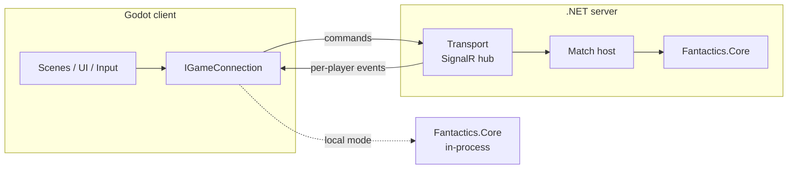

# Fantactics: Technical Design

> Status: **Draft**, started 2026-09-26. Companion to [GameDesign](GameDesign.md).

## 1. Goals

- Local (hotseat), LAN, and online play all run the **same rules code**.
- The server is **authoritative**. Clients can't cheat or see hidden information (fog of war, traps, invisible units).
- Networking lives **outside Godot**. The Godot project is a presentation layer.
- Game rules are testable with plain `dotnet test`, without Godot.

## 2. Architecture

The key decision: **keep game rules in a plain C# library with no dependency on Godot**, shared by the Godot client and the .NET server. The network layer then only moves commands and events. It never contains game logic.

Headless simulation, computer players, and LLM players drive the same Core engine in memory, with no Godot and no server. See [Simulation](Simulation.md).

### 2.1 Solution Layout (decided 2026-09-26)

All code lives under `src/` (solution at `src/Fantactics.sln`); the repo root holds only docs and config. All projects target `net8.0`.

| Project | Path | Type | Depends on | Purpose |
|---|---|---|---|---|
| `Fantactics.Core` | `src/Fantactics.Core` | Class library | — | Game state, rules, map, units, serializable commands and events, rules config loading, seeded RNG. **No Godot or network references.** |
| `Fantactics.Protocol` | `src/Fantactics.Protocol` | Class library | Core | Transport envelopes (match/seat addressing, lobby messages) around Core's commands and events, shared by client and server |
| `Fantactics.Server` | `src/Fantactics.Server` | ASP.NET Core app | Core, Protocol | Hosts matches (SignalR hub at `/game`), lobbies, LAN discovery responder |
| `Fantactics.Client` | `src/Fantactics.Client` | Godot .NET project (`project.godot` lives here) | Core, Protocol | Rendering, input, audio, UI; implements `IGameConnection` (local + remote) |
| `Fantactics.Ai` | `src/Fantactics.Ai` | Class library | Core | Computer players (`IPlayerAgent`, bots) and `MatchRunner`; used by Client, Server, and Sim. *Planned*, see [Simulation §3](Simulation.md#3-projects) |
| `Fantactics.Sim` | `src/Fantactics.Sim` | Console app | Core, Ai, Protocol | `fantactics-sim`: file-backed match CLI for LLM play, tournaments. *Planned* |
| `Fantactics.Core.Tests` | `src/tests/Fantactics.Core.Tests` | xUnit | Core | Rules tests |
| `Fantactics.Ai.Tests` | `src/tests/Fantactics.Ai.Tests` | xUnit | Core, Ai | Fuzzing, determinism, replay, and bot tests. *Planned* |

Dependency rule: nothing references `Fantactics.Client`, `Fantactics.Server`, or `Fantactics.Sim`, and `Fantactics.Core` references nothing.

### 2.2 Command / Event Model

- Clients send **commands** (intent), each answering one pending decision:
  - Before the match: `SubmitDraft`, then `PlaceStartingArmy` (both simultaneous and hidden).
  - Each turn: `SubmitMoveOrders` (paths, holds, and reserve deploys; one per player, held hidden until both are in), then `Attack`, `UseAbility`, `Wait`, or `Delay` for the unit whose initiative slot is up (see GameDesign §4.1–4.4).
- The server validates each command against the current state and, if it's legal, applies it and produces **events** (facts).
- **Events are fine-grained** (decided 2026-09-27): one per tick or strike, e.g. `UnitStepped(tick, from, to)`, `ClashMarked`, `ClashStrike`, `UnitDamaged`, `UnitHealed`, `StatusApplied`, `UnitDied`, `UnitArrived`, `TileChanged`, `TurnEnded`. The client can animate from them, and replays and logs never need a rewrite for more detail.
- **Commands and events are defined in Core** as records, serializable with polymorphic System.Text.Json (part of the standard library, so Core still doesn't reference networking). Protocol only wraps them for transport, and match records store them directly. There's no mapping layer. (Decided 2026-09-27.)
- Movement resolution is a pure Core function of the state and both players' move orders.
- Events are **filtered per player** before sending (a unit moving in the fog of war is not revealed).
- Randomness is rolled **on the server only**, with a seeded RNG.
- Game state is **immutable** (records + immutable collections); applying a command returns a new state. This makes replays, undo, and AI lookahead cheap to reason about. (Decided 2026-09-26.)
- Benefits: replays = initial state + seed + command log; reconnect = resend the player's filtered view of the state; hotseat and AI use the same path.
- The RNG state lives inside `GameState`, so applying a command is a pure function. Core also exposes `PendingDecisions`, `LegalActions`, `Preview`, `PlayerView.Project`, and `StateHash`, the seams every driver (server, client, bots, simulation) relies on. See [Simulation §2](Simulation.md#2-engine-seams-core-must-expose).

## 3. Networking

### 3.1 Requirements (turn-based)

- Low bandwidth, latency-tolerant. Reliable, ordered delivery matters more than speed.
- Reconnection mid-match without losing the game.
- LAN: find hosts on the local network without typing an IP.
- Online: some reachable server (hosted, or a player hosting with port forwarding/relay). **TBD**

### 3.2 Options

| Option | Pros | Cons |
|---|---|---|
| **ASP.NET Core SignalR** | Hub/RPC model fits command→event; strongly typed hubs; groups (= matches); auth, scale-out, and hosting are well understood; MessagePack protocol available; .NET client library | No LAN discovery built in; heavier than raw sockets; embedding a server inside the game client needs a spike |
| **LiteNetLib** (UDP) | Lightweight, widely used in games, **built-in LAN discovery**, easy to embed in both client and server | Lower-level: you design your own message framing/RPC; no web ecosystem (auth, HTTP APIs) |
| Raw TCP/WebSocket + MessagePack | Full control, minimal dependencies | You build reconnection, framing, and RPC yourself |
| Godot High-Level Multiplayer (ENet) | Built in, discovery via ENet | Ties networking to Godot, which goes against the goal |
| Steam Networking | NAT punch-through, relay, lobbies for free | Steam-only; add later if shipping on Steam |

### 3.3 Recommendation

**Use SignalR (with the MessagePack protocol) as the transport, behind an `IGameConnection` interface.** It suits a turn-based, command/event game well, and ASP.NET Core also provides whatever else online play needs later (accounts, lobbies, REST endpoints). Keeping it behind an interface means LiteNetLib or Steam can be swapped in later without touching game code.

- **LAN discovery:** a small custom UDP broadcast (the server answers "I'm hosting match X on port Y"). It's roughly 100 lines and doesn't depend on the transport.
- **LAN hosting:** the hosting player runs the server. Two ways:
  1. **Sidecar process:** the game launches a bundled, self-contained `Fantactics.Server.exe`. Simple and isolated; adds to the download size.
  2. **In-process:** host Kestrel inside the Godot process. One process, but it needs the ASP.NET Core framework in the Godot export. **Needs a spike.**
- **Hotseat:** `LocalGameConnection` calls `Fantactics.Core` directly. No server.

### 3.4 Spikes Before Committing

1. SignalR .NET client connecting from an **exported** Godot 4.7.2 build (not only in the editor).
2. Hosting the server in-process vs. sidecar from an exported build.
3. UDP broadcast discovery across two machines on the LAN (Windows Firewall prompts).
4. If mobile or web is in scope: check whether Godot C# supports those export targets and the SignalR client in 4.7.2.

## 4. Persistence — TBD

- Save/resume a match = snapshot + command log.
- Replays from the command log.
- Online accounts/stats: out of scope until online play.

## 5. Open Technical Questions

1. **Online hosting model:** a dedicated hosted server, player-hosted, or both? Who pays for and runs a hosted server?
2. **Platforms:** anything beyond desktop? Mobile/web change the transport and runtime constraints.
3. **Asynchronous play** (take your turn hours later, like play-by-mail)? If yes, SignalR + a database becomes much more attractive.
4. **AI opponent:** in scope? *Partly answered:* bots live in `Fantactics.Ai`, see only a player view, and run in-process against `Fantactics.Core` ([Simulation §4](Simulation.md#4-computer-players-fantacticsai)). Whether a shipped single-player AI opponent is in scope is still open.
5. **Spectators/replays:** needed for MVP?
6. ~~**Modding/data-driven units:** define units in JSON/Godot resources, or in C# code?~~ Decided 2026-09-27: unit stats and tunable rule numbers live in a JSON **`RulesConfig`** loaded by Core; traits and abilities are C# keyed by ID. Tournaments can A/B test config variants, and match records store the config hash ([Simulation §2](Simulation.md#2-engine-seams-core-must-expose)).
